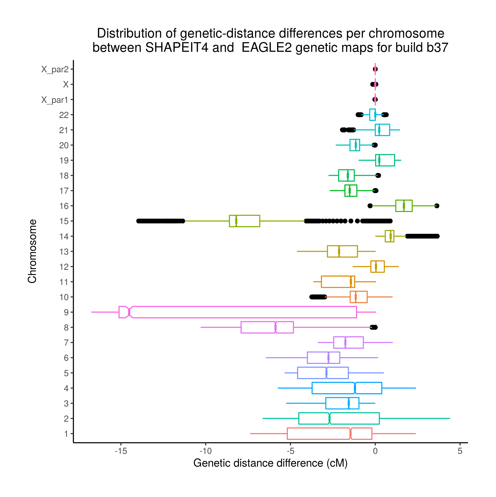
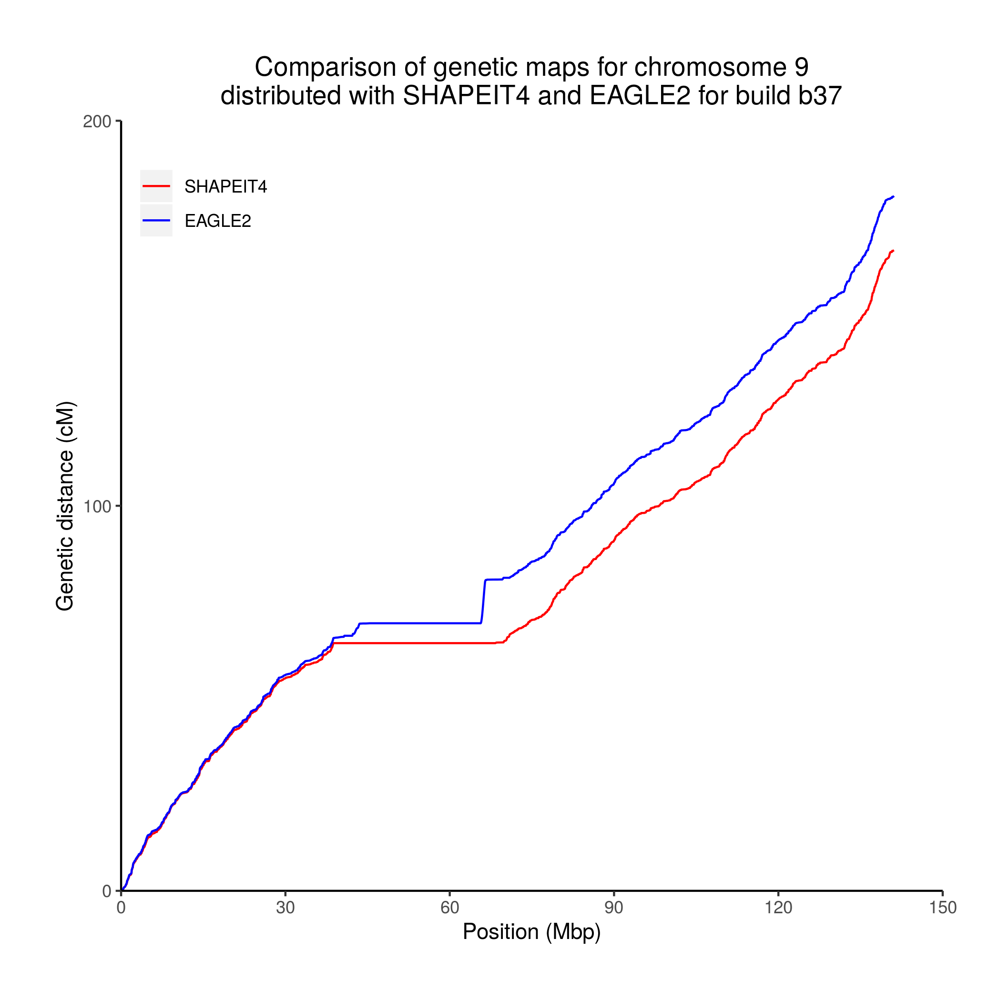
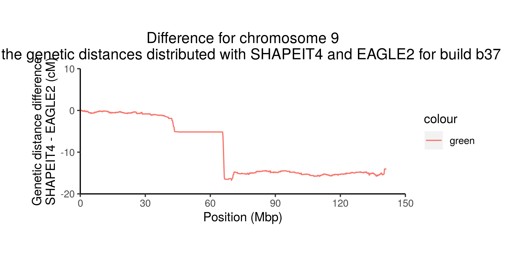
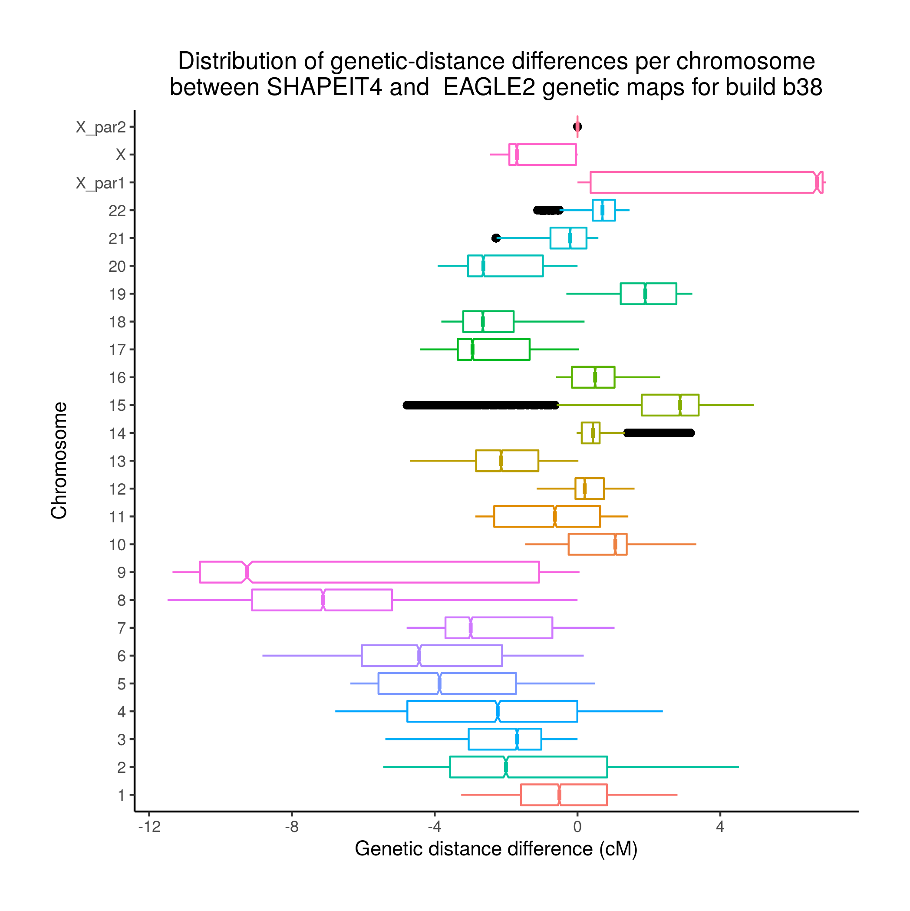

# Comparison of the genetic maps distributed with SHAPEIT4 and EAGLE2

Ph.D. Hugo Gabriel Eyherabide

22 June 2020

## Introduction

Phasing and imputation tools require the use of genetic recombination maps that they oftentimes distribute in their bundle. However, sometimes the distributed maps cannot be unpacked, let alone used. This was the case in [this question](https://www.jiscmail.ac.uk/cgi-bin/wa-jisc.exe?A2=ind2006&L=OXSTATGEN&O=D&P=6811) posted in OXSTATGEN mailing-list for the maps linked to [SHAPEIT4](https://github.com/odelaneau/shapeit4) and [IMPUTE5](https://jmarchini.org/impute5/). The question then arises as to whether these maps can be used interchangably without compatibility and results-comparability issues. Turns out that, as I show below, those maps differ not only in format but also quantitatively from the ones linked to [SHAPEIT2](https://mathgen.stats.ox.ac.uk/genetics_software/shapeit/shapeit.html), [IMPUTE2](https://mathgen.stats.ox.ac.uk/impute/impute_v2.html) and [EAGLE2](https://data.broadinstitute.org/alkesgroup/Eagle/https://data.broadinstitute.org/alkesgroup/Eagle/). This article explores these differences to shed light on potential compatibility and comparability issues.

## Format

The maps distributed with EAGLE2 and SHAPEIT4 have four (4) and three (3) columns, respectively. Specifically, the `COMBINED_rate(cM/Mb)` is present in the EAGLE2 maps (third column) but absent in the SHAPEIT4 maps. In addition, the columns in the EAGLE2 maps are separated by spaces, whereas in the SHAPEIT3 maps, by tabulators. Further, like in VCF files, the maps in EAGLE2 have the chromosome ID and base-pair positions in the first and second columns, whereas the maps in SHAPEIT4 have the locations inverted, namely the chomosome is in the second columns and the base-pair position in the first. Finally, the names of the columns differ.

As a result, converting EAGLE2 maps into SHAPEIT4 format requires to remove the third column, change the column separators, swap the first and second columns, and finally change the column names. The last step might be unimportant, but some tools may actually verify that the names are as expected. All these operations are done by the convert in [converter/eagle2_to_shapeit4.awk](converter/eagle2_to_shapeit4.awk).

## Position ranges

The initial positions coincide for most genetic maps except for chromosomes 4, 7, 11, 13 and 16 in both b37 and b38, and for chromosome 22 in b38. In all cases, the maps of SHAPEIT4 start earlier than those of EAGLE2. The last positions never differ (see [stats/b37.ranges.txt](stats/b37.ranges.txt) and [stats/b38.ranges.txt](stats/b38.ranges.txt)). 

## Sampling

The number of samples in the SHAPEIT4 maps is larger than that in the EAGLE2 maps for all chromosomes except for chromosome X_par1 and X (see [stats/b37.rows.txt](stats/b37.rows.txt) and [stats/b38.rows.txt](stats/b38.rows.txt)).

## Genetic distances

The genetic distances in the SHAPEIT4 and EAGLE2 maps differ both for the b37 and the b38 build. However, they cannot be directly compared because of the different range and sampling mentioned above. Therefore, I approximated and resample them to the same range and intervals.

### Approximation

For the approximation, I first assign the genetic distance `0 cM` to the base-pair position `0 bp`. Perhaps `0 cM` should have been assigned to `1 bp`, but the difference is most likely insignificant.

Then, I used monotonic cubic interpolation (as implemented in the R command `spline` with `method="hymen"`; see [R spline documentation](https://www.rdocumentation.org/packages/stats/versions/3.6.2/topics/splinefun) and [Wikipedia](https://en.wikipedia.org/wiki/Monotone_cubic_interpolation)) to obtained 10001 equally spaced loci (in base-pairs). For most chromosomes, this is effectively subsampling, and should have been conducted by first oversampling and low-pass filtering. However, any aliasing caused but not performing these steps plays no role in my results.

### Results

I computed the difference between the resampled genetic distances in the SHAPEIT4 maps and those in the EAGLE2 maps for all chromosomes and regions. The figure below shows the results for the build b37

As it can be seen, the SHAPEIT4 maps have typically smaller genetic distances than the EAGLE2 maps, although for some chromosomes they are predominantly larger (e.g. 14 and 16) or virtually the same (e.g. X). To gain more insight, the following two figures show the genetic distances for chromosome 9

and their difference

<!-- # References -->

<!-- + Original article: [https://adamdrake.com/command-line-tools-can-be-235x-faster-than-your-hadoop-cluster.html] -->
<!-- + Bash reference manual: [https://www.gnu.org/savannah-checkouts/gnu/bash/manual/bash.html] -->
<!-- + MAWK website: [https://invisible-island.net/mawk/mawk.html#related_mawk] -->
<!-- + MAWK pitfalls: [https://brenocon.com/blog/2009/09/dont-mawk-awk-the-fastest-and-most-elegant-big-data-munging-language/] -->
<!-- + AWK user guide: [https://www.gnu.org/software/gawk/manual/gawk.html] -->
<!-- + PGN format: [https://en.wikipedia.org/wiki/Portable_Game_Notation] -->
<!-- + PGN standard: [http://www.saremba.de/chessgml/standards/pgn/pgn-complete.htm] -->
<!-- + Chess-game data repository: [https://github.com/rozim/ChessData] -->
<!-- + Useless use of cat award: [http://porkmail.org/era/unix/award.html] -->
